# RoadWatch AI - Project Flowchart

This document illustrates the high-level architecture and data flow of the RoadWatch AI monitoring system, based on the **SEE IT → TAG IT → DONE** workflow.

## 🚀 How It Works

The system follows a streamlined 6-step process to transform raw camera data into actionable maintenance intelligence.

```mermaid
graph LR
    subgraph Step1 ["1. SEE IT"]
        CAM["Camera Captures Road<br/>(Real-time Video)"]
        DET["YOLOv8 Detects Hazards<br/>(Potholes & Cracks)"]
    end

    subgraph Step2 ["2. TAG IT"]
        GPS["GPS Tags Location<br/>(Lat / Long)"]
        API["Data Sent to Server<br/>(Image, Location, Time)"]
    end

    subgraph Step3 ["3. DONE"]
        DB["Stored in Database<br/>(Secure Persistence)"]
        DASH["Dashboard View & Action<br/>(Map & Authorities)"]
    end

    CAM -->|Records Road| DET
    DET -->|Identifies Hazard| GPS
    GPS -->|Gets Coordinates| API
    API -->|Sends via REST| DB
    DB -->|Actionable Map| DASH

    style Step1 fill:#f0f9ff,stroke:#0ea5e9,stroke-width:2px
    style Step2 fill:#f0fdf4,stroke:#22c55e,stroke-width:2px
    style Step3 fill:#fff7ed,stroke:#f97316,stroke-width:2px
```

## 🛠️ Detailed Architectural Steps

1.  **Camera Captures Road**: Dashcam or mobile camera records real-time video of the road infrastructure.
2.  **YOLOv8 Detects Hazards**: Our custom-trained AI model identifies potholes, cracks, and other hazards in the video frames.
3.  **GPS Tags Location**: The system automatically captures the exact latitude and longitude of the detected hazard using GPS data (or Geotagger module).
4.  **Data Sent to Server**: The Hazard image, GPS location, and timestamp are securely sent via the API to the central Flask server.
5.  **Stored in Database**: All detection data is securely saved in a MongoDB database for future access and audit trails.
6.  **Dashboard View & Action**: Authorities see the hazards visualized on an interactive map and can take immediate action to prioritize repairs.

---

### **SEE IT → TAG IT → DONE**
