# RoadWatch AI - Automated Road Infrastructure Monitoring


## 🌟 Overview

**RoadWatch AI** is a state-of-the-art vision-based monitoring system designed to revolutionize urban infrastructure maintenance. Leveraging the power of deep learning and real-time geospatial data enrichment, RoadWatch AI transforms standard video feeds into actionable maintenance intelligence.

### 🚀 Key Features

*   **⚡ Real-Time Detection**: High-accuracy pothole and hazard detection using YOLOv8.
*   **📍 Precise Geotagging**: Automatic GPS coordinate attachment and reverse geocoding via Google Maps Geocoding API.
*   **📊 Insightful Dashboard**: Interactive visualization of hazard hotspots, trends, and repair metrics built with Plotly Dash.
*   **🛠️ Efficient Reporting**: Automated submission of hazard reports for city maintenance teams.

---

## How it works ?


## 🛠️ Tech Stack & Tools


---

## 🏗️ High-Level Architecture (HLA)

The system transforms raw dashcam feeds into actionable infrastructure data through a streamlined **SEE IT → TAG IT → DONE** lifecycle.

```mermaid
graph LR
    subgraph S1 ["1. SEE IT"]
        CAM["Camera Captures Road<br/>(Real-time Video)"]
        DET["YOLOv8 Detects Hazards<br/>(Potholes & Cracks)"]
    end

    subgraph S2 ["2. TAG IT"]
        GPS["GPS Tags Location<br/>(Lat / Long)"]
        API["Data Sent to Server<br/>(Image, Location, Time)"]
    end

    subgraph S3 ["3. DONE"]
        DB["Stored in Database<br/>(Secure Persistence)"]
        DASH["Dashboard View & Action<br/>(Map & Authorities)"]
    end

    CAM -->|Records Road| DET
    DET -->|Identifies Hazard| GPS
    GPS -->|Gets Coordinates| API
    API -->|Sends via REST| DB
    DB -->|Actionable Map| DASH

    style S1 fill:#f0f9ff,stroke:#0ea5e9,stroke-width:2px
    style S2 fill:#f0fdf4,stroke:#22c55e,stroke-width:2px
    style S3 fill:#fff7ed,stroke:#f97316,stroke-width:2px
```



### 🔁 The 6-Step Lifecycle
1.  **Camera Captures Road**: Dashcam records real-time video of the infrastructure.
2.  **YOLOv8 Detects Hazards**: AI model identifies potholes, cracks, and other hazards.
3.  **GPS Tags Location**: The system fetches exact latitude and longitude of the hazard.
4.  **Data Sent to Server**: Image, location, and time are sent via REST API.
5.  **Stored in Database**: Data is securely saved for future access and repair planning.
6.  **Dashboard View & Action**: Authorities see hazards on a map and take action fast.

---
### 📁 Project Structure

```text
Road-Management-System/
├── app.py                # Main Flask application (Server entrypoint)
├── dashboard.py          # Plotly Dash interactive frontend
├── config.py             # Global environment & project configuration
├── storage.py            # MongoDB and local storage operations
├── yolo_detect.py        # Core YOLOv8 inference wrapper
├── LiveCamera.py         # Subprocess for real-time camera handling
├── reporter.py           # Automated report formatting
├── geotagger.py          # Geographic enrichment helper
├── requirements.txt      # Python dependencies
├── .env                  # Configuration keys (API Keys, DB URIs)
└── static/               # Repository for auto-generated hazard images
```

---

## ⚙️ Setup & Installation

### 1️⃣ Clone and Prepare
```bash
# Clone the repository
git clone https://github.com/yourusername/Road-Management-System.git
cd Road-Management-System

# Install dependencies
pip install -r requirements.txt
```

### 2️⃣ Configure Environment
Create a `.env` file in the root directory:
```env
# Database Configuration
MONGO_URI=mongodb://localhost:27017
MONGO_DB=road_monitoring
MONGO_COLLECTION=potholes

# API Keys
GOOGLE_MAPS_API_KEY=your_google_maps_api_key_here

# Application Settings
FLASK_SECRET_KEY=generate_a_secure_key
FLASK_PORT=8050

# Model Sensitivity
DETECTION_INTERVAL=10
CONFIDENCE_THRESHOLD=0.5
```

---

## 🚦 Usage

1.  **Launch the System**:
    ```bash
    python app.py
    ```
2.  **Access the Analytics Dashboard**:
    Open [http://localhost:8050/dashboard/](http://localhost:8050/dashboard/)
3.  **Initiate Monitoring Loop**:
    Directly start the feed via: [http://localhost:8050/camera/start?source=0](http://localhost:8050/camera/start?source=0)

---

## 📡 API Reference

| Endpoint | Method | Purpose |
| :--- | :--- | :--- |
| `/health` | `GET` | System health and model connectivity check |
| `/api/report` | `POST` | High-level hazard reporting endpoint |
| `/api/potholes` | `GET` | Retrieve chronological detection records |
| `/api/stats` | `GET` | Dashboard data aggregation |
| `/api/hotspots` | `GET` | Clustered hazard density mapping |

---

## 📜 License
This project is licensed under the MIT License - see the LICENSE file for details.

---
*Created by [Your Name](https://github.com/yourusername)*
